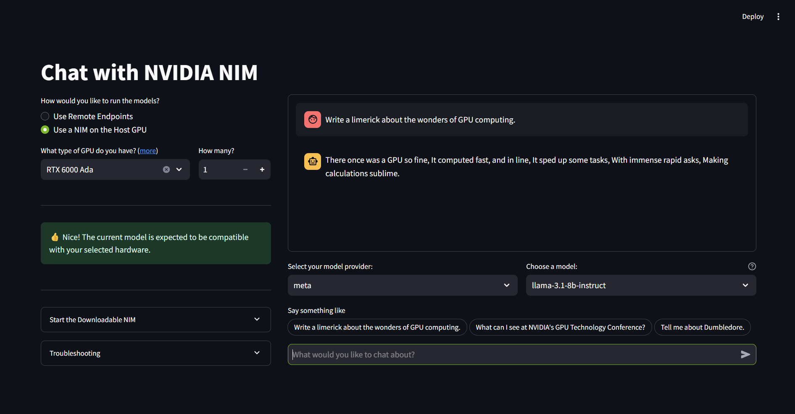

# An Easy Button for NVIDIA Endpoints and NIMs 
This chat application works interchangeably with build.nvidia.com API endpoints and downloadable NVIDIA NIM containers on NVIDIA GPUs. It makes testing with NVIDIA endpoints and self-hosted NIMs easy. 

This project is fairly easy to customize because it's a simple Streamlit app that aims to replicate the build.nvidia.com experience on your local hardware.

> **Note**
> This app runs in [NVIDIA AI Workbench](https://docs.nvidia.com/ai-workbench/user-guide/latest/overview/introduction.html). It's a free, lightweight developer platform that you can run on your own systems to get up and running with complex AI applications and workloads in a short amount of time. 

> You may want to [**fork**](https://docs.github.com/en/pull-requests/collaborating-with-pull-requests/working-with-forks/fork-a-repo#forking-a-repository) this repository into your own account before proceeding. Otherwise you won't be able to fully push any changes you make because this NVIDIA-owned repository is **read-only**.

 

*Navigating the README*: [Project Overview](#project-overview) | [Get Started](#get-started) | [Deep Dive](#deep-dive) | [Self-Hosted Sizing Guide](#nim-requirements) | [License](#license)

*Other Resources*: [:arrow_down: Download AI Workbench](https://www.nvidia.com/en-us/deep-learning-ai/solutions/data-science/workbench/) | [:book: User Guide](https://docs.nvidia.com/ai-workbench/) |[:open_file_folder: Other Projects](https://docs.nvidia.com/ai-workbench/user-guide/latest/quickstart/example-projects.html) | [:rotating_light: User Forum](https://forums.developer.nvidia.com/t/support-workbench-example-project-agentic-rag/303414)

## Project Overview

#### Using the Application

1. Select the Build endpoint or downloadable NIM mode.
   - Build endpoints (default) do not require a GPU.
      * Ensure your ``NVIDIA_API_KEY`` is configured in AI Workbench.
   - To self-host a downloadable NIM, select your GPU to see compatible options.
      * Download and run the NIM locally via Compose in AI Workbench.

2. Pick a model to chat with.
   - For downloadable NIMs, match it to your locally-running NIM.

3. Start chatting.

#### Modifying the Application

As a Python app, you can modify it easily in any code editor.

1. Start JupyterLab and open `code > Chat.py`.
   - Or use VS Code/Cursor.
  
2. Make whatever changes to the code you want.

3. Refresh the streamlit window for changes to take effect.

## Get Started
This app runs in [NVIDIA AI Workbench](https://docs.nvidia.com/ai-workbench/user-guide/latest/projects/projects.html#projects-structure). Start with the Build endpoints for the fastest setup.

#### Prerequisites
1. Install [AI Workbench](https://docs.nvidia.com/ai-workbench/user-guide/latest/installation/overview.html).

2. A build.nvidia.com API Key for a valid NVIDIA Developer Account.
   * Go to [build.nvidia.com](https://build.nvidia.com/) and click `Login`.
   * Create a cloud account, verify email.
   * After successful login, generate and save an API Key from any model card on build.nvidia.com.

#### Starting the Chat

1. Open AI Workbench and pick a Location.

2. Use the repository URL to clone this project with AI Workbench and wait for it to build. 

3. In the warning banner, select **Resolve Now** and configure your ``NVIDIA_API_KEY`` when prompted. (See [prerequisites](#prerequisites))

4. Select **Open Chat** in the top right of the window.

5. Pick "Use NVIDIA Endpoints" and your model.

6. Start chatting!

## Deep Dive

#### Downloadable NIMs on a local GPU

>**Note:**
> This assumes you've done the Getting Started steps.

An [NVIDIA NIM](https://developer.nvidia.com/nim) is an inference container that auto-optimizes for your GPU. Optimized profiles for NIMs may require select GPUs, but models can run unoptimized on any NVIDIA GPU with adaquate VRAM and disk space.

This chat app helps pick a NIM that best fits your setup.

##### NIM Requirements

1. A supported [NVIDIA GPU](https://docs.nvidia.com/nim/large-language-models/latest/supported-models.html#gpus).

2. Must use Docker runtime. If the AI Workbench is configured to use Podman, see [runtime switch guide](https://docs.nvidia.com/ai-workbench/user-guide/latest/reference/runtimes.html) for how to switch to Docker.

##### Using a NIM

AI Workbench utilizes [Docker Compose](https://docs.nvidia.com/ai-workbench/user-guide/latest/projects/compose.html#overview-of-docker-compose-in-ai-workbench).

1. Pick `Use a NIM on the Host GPU` in the chat app and enter your GPU details.

2. Choose your desired model.
   * Check VRAM and/or disk space recommendations.

3. In AI Workbench, go to `Environment > Compose > Containers` and select the corresponding model profile.

4. Click **Start** and wait for setup. Monitor the Compose logs under **Output**

5. Start chatting in the chat app when the NIM is ready for inference.

## License
This NVIDIA AI Workbench example project is under the [Apache 2.0 License](https://github.com/NVIDIA/workbench-example-downloadable-nim/blob/main/LICENSE.txt)

This project may download and install additional third-party open source software projects. Review the license terms of these open source projects before use. Third party components used as part of this project are subject to their separate legal notices or terms that accompany the components. You are responsible for confirming compliance with third-party component license terms and requirements. 
